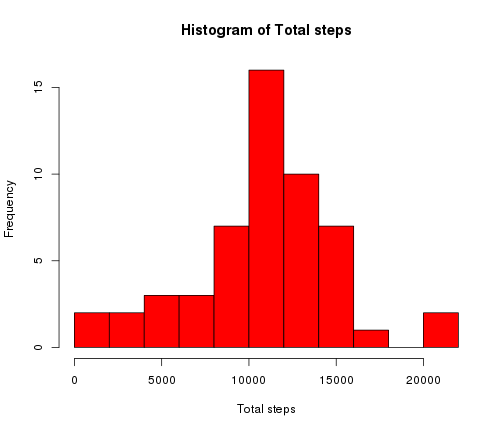
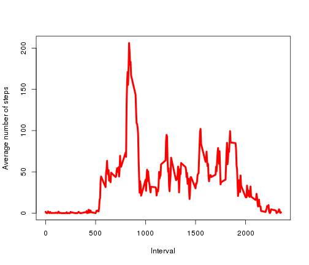
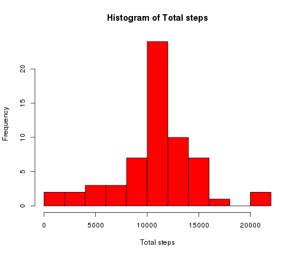
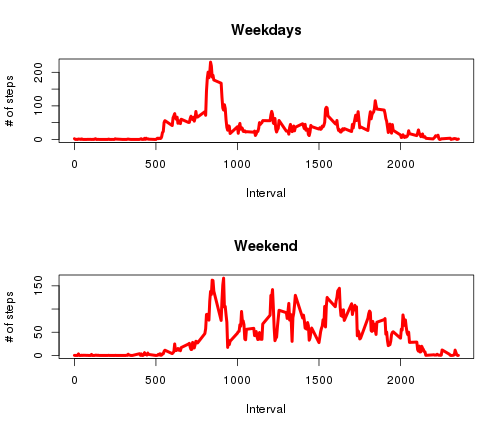

*Reproducible Research*: Peer Assessment 1
========================================================

## Summary

This assignment makes use of data from a personal activity monitoring device. This device collects data at 5 minute intervals through out the day. The data consists of two months of data from an anonymous individual collected during the months of October and November, 2012 and include the number of steps taken in 5 minute intervals each day.

## Data

The data for this assignment can be downloaded from the course web site:

- Dataset: [Activity monitoring data](https://d396qusza40orc.cloudfront.net/repdata%2Fdata%2Factivity.zip) [52K]

The variables included in this dataset are:

1. **steps**: Number of steps taking in a 5-minute interval (missing values are coded as NA)

2. **date**: The date on which the measurement was taken in YYYY-MM-DD format

3. **interval**: Identifier for the 5-minute interval in which measurement was taken

### Loading and preprocessing the data


```r
data<-unzip("activity.zip")
file_a<-"activity.csv"
activity<-read.csv(file_a, header = TRUE, sep = ",",colClasses=c('numeric','Date','numeric'))
unlink(data)
```
### What is mean total number of steps taken per day?

Calculate the total number of steps taken per day


```r
un<-unique(activity$date)
total_steps<-NULL
mean_steps_daily<-NULL
median_steps_daily<-NULL
for(k in 1:length(un)){
ran<-which(activity$date==un[k])
total_steps[k]<-sum(activity$steps[ran])
mean_steps_daily[k]<-mean(activity$steps[ran])
median_steps_daily[k]<-median(activity$steps[ran])
}
```

Histogram of the total number of steps taken each day:


```r
hist(total_steps,breaks=15,col='red',xlab='Total steps',main='Histogram of Total steps')
```

 

Calculate and report the mean and median of the total number of steps taken per day, the mean value gives an estimate of the total steps per day. 


```r
summary(total_steps)
```

```
##    Min. 1st Qu.  Median    Mean 3rd Qu.    Max.    NA's 
##      41    8841   10760   10770   13290   21190       8
```


### What is the average daily activity pattern?

Calculate the daily average number of steps 


```r
ur<-unique(activity$interval)
steps_interval<-NULL
for(j in 1:length(ur)){
ran1<-which(activity$interval==ur[j])
steps_interval[j]<-mean(activity$steps[ran1],na.rm=TRUE)
}
```

To visualize I make a time series plot of the 5-minute interval (x-axis) and the average number of steps taken, averaged across all days (y-axis)


```r
plot(ur,steps_interval,type='l',col='red',lwd=4,ylab='Average number of steps',xlab='Interval')
```

 

The maximum nuber of steps taken per day can be calculated as follows: 


```r
 maxim<-which.max(steps_interval)
 hr <- floor(maxim*5/60)
    min <- (maxim*5/60 - hr) * 60
    timef<-paste(hr,min,sep=':')
print(timef)
```

```
## [1] "8:40"
```
This time is the moment of the day with maximum steps taken. 

### Imputing missing values

Calculate and report the total number of missing values in the dataset: 


```r
length(which(is.na(activity)))
```

```
## [1] 2304
```

The number reported above is the total number of missing values. 


```r
NewData<-NULL
for(i in 1:length(activity$steps)){
  if(is.na(activity$steps[i])){
    aux_int<-activity$interval[i]
    index<-which(ur==aux_int)
    NewData[i]<-steps_interval[index]
  }else{NewData[i]<-activity$steps[i]}
  }
```

Create a new dataset that is equal to the original dataset but with the missing data filled in. I have chosen the daily average number of steps for each interval. 


```r
activitynew<-data.frame(NewData,activity$date,activity$interval,stringsAsFactors=FALSE)
names(activitynew) <- c("steps","date","interval")
```

Calculate the total number of steps taken per day


```r
un<-unique(activitynew$date)
total_steps_new<-NULL
mean_steps_daily_new<-NULL
median_steps_daily_new<-NULL
for(k in 1:length(un)){
ran<-which(activitynew$date==un[k])
total_steps_new[k]<-sum(activitynew$steps[ran])
mean_steps_daily_new[k]<-mean(activitynew$steps[ran])
median_steps_daily_new[k]<-median(activitynew$steps[ran])
}
```


```r
hist(total_steps_new,breaks=15,col='red',xlab='Total steps',main='Histogram of Total steps')
```

 

In order to compare the mean and the median I use the summary function again applied to the new variable. 


```r
summary(total_steps_new)
```

```
##    Min. 1st Qu.  Median    Mean 3rd Qu.    Max. 
##      41    9819   10770   10770   12810   21190
```

The median presents a differences with the previously calculated value due to the biased of the NAs. 


### Are there differences in activity patterns between weekdays and weekends?

Create a new factor variable in the dataset with two levels -- "weekday" and "weekend" indicating whether a given date is a weekday or weekend day.


```r
Weekend<-NULL
Weekd<-weekdays(activitynew$date)
for(i in 1:length(Weekd)){
if(Weekd[i]=="Saturday"|Weekd[i]=="Sunday"){
Weekend[i]<-0
}else{Weekend[i]<-1}
}
```

Make a panel plot containing a time series plot  of the 5-minute interval (x-axis) and the average number of steps taken, averaged across all weekday days or weekend days (y-axis). Both panels for comparison: 


```r
DF<-data.frame(activitynew,Weekend,stringsAsFactors=FALSE)
DFwd<-data.frame(DF[DF[,4]==1,])
names(DFwd) <- c("steps","date","interval","weekday")
DFwe<-data.frame(DF[DF[,4]==0,])
names(DFwe) <- c("steps","date","interval","weekend")

urwd<-unique(DFwd$interval)
steps_interval_wd<-NULL
for(j in 1:length(urwd)){
ran1<-which(DFwd$interval==urwd[j])
steps_interval_wd[j]<-mean(DFwd$steps[ran1],na.rm=TRUE)
}

urwe<-unique(DFwe$interval)
steps_interval_we<-NULL
for(j in 1:length(urwe)){
ran1<-which(DFwe$interval==urwe[j])
steps_interval_we[j]<-mean(DFwe$steps[ran1],na.rm=TRUE)
}
```


```r
par(mfrow=c(2,1)) 

plot(urwd,steps_interval_wd,type='l',col='red',lwd=4,xlab='Interval',ylab="# of steps",main="Weekdays")
plot(urwe,steps_interval_we,type='l',col='red',lwd=4,xlab='Interval',ylab="# of steps",main="Weekend")
```

 

There are clear differences between the activity pattern between weekdays and weekend. During the weekdays the maximum is close the the 8:40 and during the rest of the intervals the amount of steps is clearly low. In contrary to what happens during weekend days where the total steps per interval increases after 8:40, possibly due to the more activity one has in weekends.   

